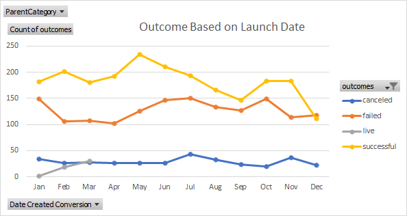
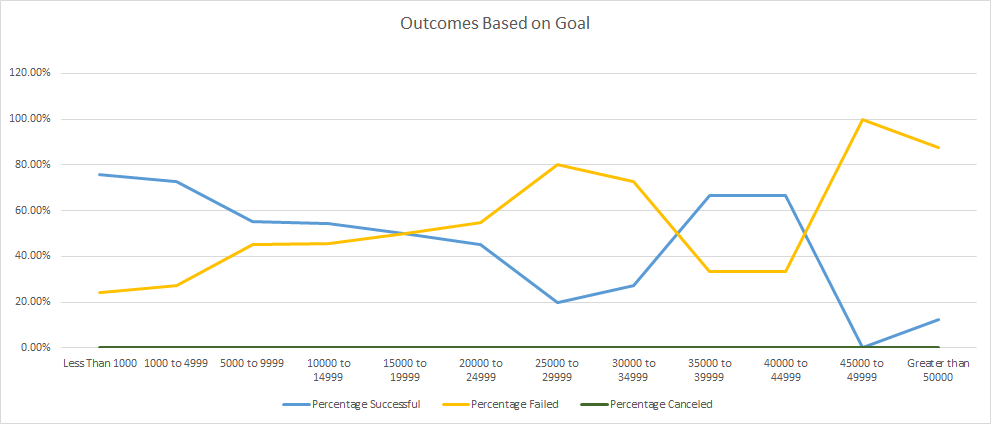

## Overview of Project
This report contains data pertaining to 4000 Kickstarter campaigns that ran between 2009 and 2017.
---
### Purpose
  The purpose of this project was to provide data-based insight into what separates failed Kickstarter campaigns from successful ones. Particularly Kickstarter campaigns involving fundraising for theater productions. The data was provided in excel format of 4113 Kickstarter campaigns with around 14 data points collected and 5 additional data points extrapolated for readability between the year 2009 and 2017.

---
## Analysis and Challenges
  The data provided some very interesting and potentially useful insights on Kickstarter campaigns. It is important to note the average Kickstarter campaign is successful about 66% of the time in this data set, so roughly 2/3rds of campaigns are successful.  The success rate is slightly lower for Kickstarter pertaining to theater with a success rate of 61%.  This data is already several years old so more recent data in combination with historical data is likely to yield better more reliable predictions.
---
### Analysis of Outcomes Based on Launch Date
  Theater Kickstarter campaigns that launch in May and June seem to be the most successful, with a success rate of 67% and 65% respectively. The success rate drops steadily through fall and winter where it reaches an all-time low in December with around a 50% success rate.  It is important to note a similar trend is seen across all categories of Kickstarter campaigns.  The most successful campaigns tend to be in May and June. While the least successful tend to be in December.  Further analysis is recommended, possible reason may be competition from other fundraising events and campaigns outside of Kickstarter.

---
### Analysis of Outcomes Based on Goals
  The overwhelming number of campaigns where for under $5000 (close to 70% of the fundraising campaigns in the data set). The campaigns that had the highest success rate had goals under $1000 being successful %76 of the time. Meaning 3/4ths of all campaigns under $1000 were successful. The second most successful bracket of campaigns aimed to raise between $1000 to $5000, those campaigns had a success rate of nearly 73%.
There did appear to be some success in the $35000-$45000 range however pooling from less than ten projects within that goal range there is not enough data to make an accurate prediction, however further analysis might be recommended.

---
### Challenges and Difficulties Encountered
  While the sample size of 4000 is sufficiently large enough to begin to make accurate predictions, 70% of those are under the goal of $5000 so predictions for larger goals are not as accurate.  As mentioned previously the data is already 3-4 years old so more data including more recent years would be beneficial to make more accurate predictions.  Particularly data of the past two years since the pandemic to see how fundraising has changed on Kickstarter.
---
## Results

---
- What are two conclusions you can draw about the Outcomes based on Launch Date?
  1. Kickstarter campaigns launched in summer months are more likely to be successful
  2. Kickstarter campaigns launched in winter months are less likely to be successful
 
- What can you conclude about the Outcomes based on Goals?
The smaller the goal the more likely a Kickstarter campaign is to meet its goal.
Generally, the most successful Kickstarter campaigns are under $1,000 with a success rate just under 76%. The second most successful campaigns in the $1000 to $4999 range with a success rate just under 73%.  So a campaign is most likely to reach its goal if that goal is under $5000.

- What are some limitations of this dataset?
We don’t know how complete the data is, was there only 4000 Kickstarter campaigns in that period?
The data for the number of cancelled Kickstarter campaigns for October are missing. 
The data seems to be several years old. A lot has changed the past couple years particularly pertaining to theater, more recent up to date, especially data from 2020 onward.
There does not seem to be nearly as many Kickstarter campaigns over $15000 so the predictions for Kickstarter campaigns in that goal range would not be as accurate

- What are some other possible tables and/or graphs that we could create?
number_of_backers vs % of successful campaigns perhaps by each bracket of fundraising goals to see how many backers are required to reasonably to attain each goal bracket (i.e., how many backers for a successful goal of $35000)
